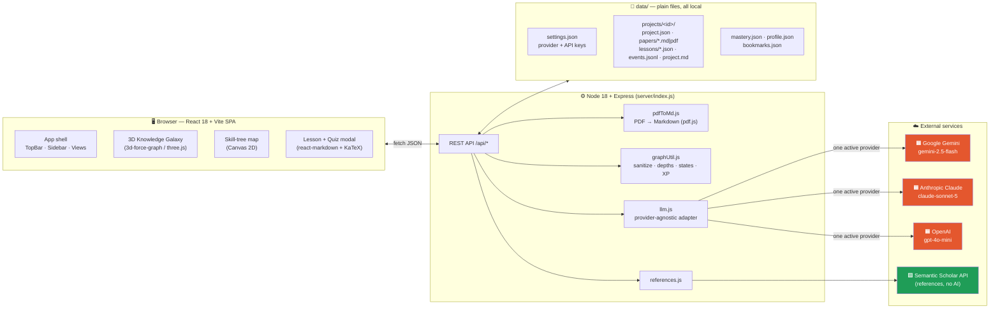
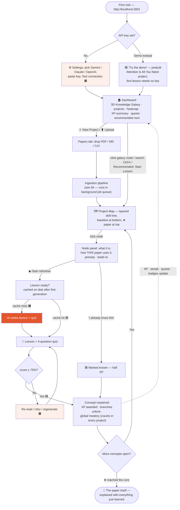
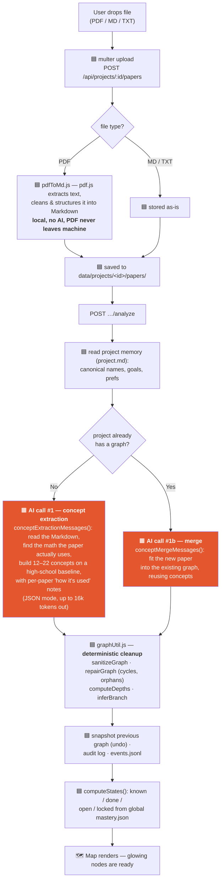
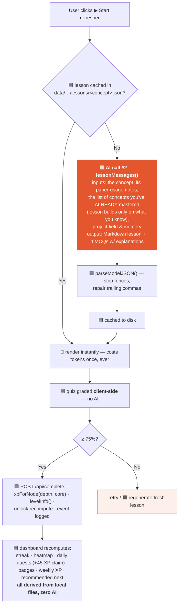
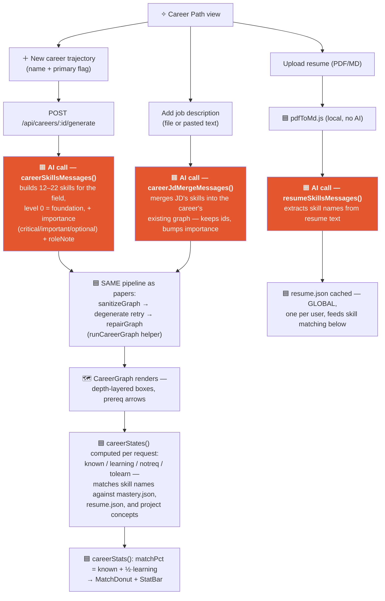

# PaperQuest — Architecture

How the app is put together: the user flow, the tech behind each screen, and — for every process — **what is done by plain local tools** vs **what is done by an AI model**, and which AI that is.

> Legend used in every diagram:
> 🟧 **AI** = one call to the configured LLM provider · 🟦 **Local tool** = deterministic code on your machine · 🟩 **External API** = non-AI web service

---

## 1. System overview

**Key property:** the AI never sees your PDF. PDFs are converted to text locally with pdf.js; only the extracted Markdown is sent to the provider you chose. Keys live in `data/settings.json` and go nowhere else.

---

## 2. Tech stack

| Layer | Technology | Used for |
|---|---|---|
| Frontend | React 18, Vite 5 | SPA, state, build/dev server |
| 3D galaxy | `3d-force-graph` (three.js + d3-force-3d) | Dashboard/Explore hero: cross-project concept network |
| 2D graphics | HTML Canvas 2D | Skill-tree map (`SkillTreeCanvas`), 2D galaxy fallback (`BrainMap`) |
| Math & docs | `react-markdown`, `remark-gfm`, `remark-math`, `rehype-katex`, KaTeX | Lesson rendering, paper reader |
| Design | Custom CSS design system (warm-paper light theme from the claude.ai/design project) | Space Grotesk / Inter / JetBrains Mono, `#E4572E` primary, `#2E86AB` secondary |
| Backend | Node 18+, Express 4, multer | REST API, file uploads |
| PDF extraction | `pdfjs-dist` (Mozilla pdf.js) | **Local, no AI** PDF → Markdown |
| AI adapter | `server/llm.js` (plain `fetch`, no SDKs) | One interface over Gemini / Anthropic / OpenAI, JSON mode, 240 s timeout, malformed-JSON repair |
| Storage | Plain JSON / Markdown / JSONL files in `data/` | No database — copy the folder to back up everything |
| References | Semantic Scholar Graph API | Citation network (external API, **not** AI) |

### Which AI, exactly?

| Provider | Default model | API |
|---|---|---|
| Google Gemini *(default)* | `gemini-2.5-flash` | `generativelanguage.googleapis.com :generateContent` |
| Anthropic | `claude-sonnet-5` | `api.anthropic.com/v1/messages` |
| OpenAI | `gpt-4o-mini` | `api.openai.com/v1/chat/completions` |

Exactly **one provider is active at a time** (chosen in ⚙ Settings; model name is free-text so any current model works). Every AI feature goes through the same `callLLM()` in `server/llm.js`. There are only **three AI call sites** in the whole codebase:

1. **Settings → Test connection** — a tiny prompt to validate the key/model.
2. **Paper analysis** — build or merge the prerequisite concept graph.
3. **Lesson generation** — write a lesson + 4-question quiz for one concept.

Everything else — XP, levels, streaks, quests, badges, graph layout, unlock logic, heatmaps, recommendations — is deterministic local code.

---

## 3. User flow (end to end)

Other journeys from the same dashboard: **Projects** view (open/rename/delete), **Explore** (full-screen galaxy), **Career Paths** (per-branch progress), **Read** drawer (paper reader with notes), **History** tab (activity log, undo last analysis, project memory), **References** (Semantic Scholar 🟩), **Daily Quest** (claim +45 XP — computed and granted locally 🟦).

---

## 4. Paper ingestion: where tools end and AI begins

## 5. Learning loop: lesson, quiz, progress

---

## 6. Career Path: resume, job descriptions, skill graph

Global feature, not tied to any project — the user picks career trajectories and
gets an AI-built skills graph (same node shape as a paper's concept graph) colored
by what they already know, cross-referenced against global mastery and their resume.

All three AI calls run through `jobs.jsx` (`career-generate`, `career-resume`,
`career-jd` job kinds) with the same background progress dock and retry-on-failure
as paper analysis and lessons. Details: [wiki/career.md](wiki/career.md).

---

## 7. AI vs tools — the complete ledger

| Process | Done by | Detail |
|---|---|---|
| PDF → Markdown | 🟦 Local tool | pdf.js text extraction + cleanup (`server/pdfToMd.js`) |
| Concept graph (new paper) | 🟧 **AI** | `conceptExtractionMessages` → active provider, JSON out |
| Concept graph (additional paper) | 🟧 **AI** | `conceptMergeMessages` — merge into existing graph |
| Graph repair, cycles, depths, branches | 🟦 Local tool | `graphUtil.js` — deterministic post-processing of AI output |
| Skill-tree layout & rendering | 🟦 Local tool | barycenter DAG layout (`graphLayout.js`) + Canvas 2D |
| 3D galaxy | 🟦 Local tool | force simulation in the browser (three.js), colors from state |
| Lesson + quiz authoring | 🟧 **AI** | `lessonMessages`, cached to disk after first call |
| Quiz grading, XP, levels, unlocks | 🟦 Local tool | pure functions (`xpForNode`, `levelInfo`, `computeStates`) |
| Streak, heatmap, daily quests, badges, weekly XP | 🟦 Local tool | derived from `events.jsonl` + `mastery.json` timestamps |
| Recommended next concept | 🟦 Local tool | ready node that unlocks the most others (edge counting) |
| Paper references / citations | 🟩 External API | Semantic Scholar Graph API — a web service, not an LLM |
| Settings "Test connection" | 🟧 **AI** | 1-line prompt to verify key + model |
| Career skills graph (new field) | 🟧 **AI** | `careerSkillsMessages` → same sanitize/repair pipeline as papers |
| Resume skill extraction | 🟧 **AI** | `resumeSkillsMessages` — reads converted resume Markdown |
| JD merge into career graph | 🟧 **AI** | `careerJdMergeMessages` — keeps ids, bumps importance |
| Career skill match (known/learning/tolearn), match % | 🟦 Local tool | `careerStates`/`careerStats` — name matching against mastery.json/resume.json |
| Search, navigation, project memory, undo, export | 🟦 Local tool | file reads/writes only |

**Rule of thumb:** AI is used exactly where judgment about *content* is needed (what math a paper stands on, how to teach a concept). Every *mechanic* — scoring, unlocking, progress, gamification, rendering — is ordinary local code, so it's fast, free, and reproducible.
